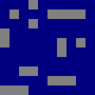

# nanoservice

[](https://github.com/Slava0135/nanoservice/actions/workflows/test.yml)

## About

Small service resembling "battleship" puzzle game that:

* Can generate ship layout as plain text or image
* Can validate ship layout
* Can replay game given layout and shots made

Game variation:

* Game field is 10 by 10 squares
* There are:
  * 4 ships of size 1
  * 3 ships of size 2
  * 2 ships of size 3
  * 1 ship of size 4

## Building

Docker image is provided:

```sh
docker build -t nanoservice .
docker run -dp 8080:8080 nanoservice:latest
```

You can also run it with:

```sh
go run main.go
```

Or build and run:

```sh
go build -o app
./app
```

## Features

### Generate ship layout

Example request:

```sh
curl -i http://localhost:8080/generate
```

Output:

```text
{{7 4} {7 4}}
{{5 4} {5 4}}
{{6 1} {6 1}}
{{4 0} {4 0}}
{{1 3} {2 3}}
{{9 1} {9 2}}
{{2 6} {3 6}}
{{0 8} {2 8}}
{{6 6} {8 6}}
{{5 8} {8 8}}
```

Those are ship coordinates, e.g. last ship is on squares `{5 8}, {6 8}, {7 8}, {8 8}`

### Generate ship layout as grid

Example request:

```sh
curl -i http://localhost:8080/generate/grid
```

Output:

```text
oo#oo###o#
ooooooooo#
#oo#o#oooo
ooo#o#oo#o
ooo#oooooo
o#o#oooooo
o#oooooooo
o#ooo##ooo
oooooooooo
ooo#oooooo
```

`o` means the square is empty, `#` means there is a ship

### Generate ship layout as image

Example request:

```sh
curl -i http://localhost:8080/generate/image
```

Output:



### Validate ship layout

Example request:

```sh
curl -i http://localhost:8080/validate -d "{{7 5} {7 5}}
{{2 7} {2 7}}
{{2 3} {2 3}}
{{0 5} {0 5}}
{{6 2} {7 2}}
{{3 9} {4 9}}
{{9 3} {9 4}}
{{4 1} {4 3}}
{{6 8} {8 8}}
{{2 5} {5 5}}"
```

Output:

```text
true
```

If layout is not valid (try to remove 1 ship) it would output `false`

You can use different format:

```sh
curl -i http://localhost:8080/validate -d "#ooooooooo
#o#oooo#oo
oooo#oo#o#
ooooooo#o#
#oooo#oooo
#ooooooo#o
#ooooooo#o
#o#ooooo#o
oo#oo#oooo
oooooooooo"
```

Output:

```text
true
```

### Replay game

Example request:

```sh
curl -i http://localhost:8080/replay -d "{{7 5} {7 5}}
{{2 7} {2 7}}
{{2 3} {2 3}}
{{0 5} {0 5}}
{{6 2} {7 2}}
{{3 9} {4 9}}
{{9 3} {9 4}}
{{4 1} {4 3}}
{{6 8} {8 8}}
{{2 5} {5 5}}
+
{0 0}
{9 4}
{9 3}
{5 5}"
```

Output:

```text
Untouched:
{{7 5} {7 5}}
{{2 7} {2 7}}
{{2 3} {2 3}}
{{0 5} {0 5}}
{{6 2} {7 2}}
{{3 9} {4 9}}
{{4 1} {4 3}}
{{6 8} {8 8}}
Damaged:
{{2 5} {5 5}}
Destroyed:
{{9 3} {9 4}}
```

You can use different format:

```sh
curl -i http://localhost:8080/replay -d "#ooooooooo
#o#oooo#oo
oooo#oo#o#
ooooooo#o#
#oooo#oooo
#ooooooo#o
#ooooooo#o
#o#ooooo#o
oo#oo#oooo
oooooooooo
+
{0 0}
{7 0}
{2 1}
{0 7}"
```

Output:

```text
Untouched:
{{2 7} {2 9}}
{{4 2} {4 2}}
{{5 4} {5 4}}
{{5 8} {5 8}}
{{7 1} {7 4}}
{{8 5} {8 8}}
{{9 2} {9 4}}
Damaged:
{{0 0} {0 2}}
{{0 4} {0 8}}
Destroyed:
{{2 1} {2 1}}
```
